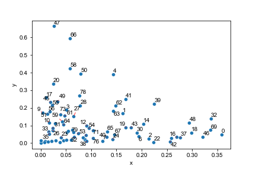

## Label points on a matplotlib graph with adjustments and arrows as needed.

Uses adjustText to find the spot to place text and arrows.
adjustText did not have the options to plot a subset of points based on how many neighbors were near, or to plot an arrow only if needed.

Set n_points_too_close_to_label to not plot labels for points with too many neighbors (default 4).
Set n_points_too_close_to_need_arrow to not include an arrow for points with few neighbors (default 1).

If arrowprops is not False (default), labels with an arrow. 
adjustText is used to plot the text labels.
Extra keyword arguments are passed to adjustText.adjust_text.
A higher scale_cutoff is a higher proximity cutoff (fewer labels).
For faster plotting of huge numbers of datapoints, use no_adjust=True.

Requires:
* sklearn
* numpy
* matplotlib
* adjustText (https://github.com/Phlya/adjustText)

Example:
```
import plottingFunctions
import pandas
import matplotlib.pyplot as plt
import numpy as np
import seaborn as sns

q = pandas.DataFrame(np.random.gamma(1,.1, size=(80, 2)), columns=list('xy'))
fig, ax = plt.subplots()
sns.scatterplot(data=q, x='x', y='y')
plottingFunctions.label_outliers(
    q['x'], q['y'], q.index, scale_cutoff=.8, n_points_too_close_to_label=3, n_points_too_close_to_need_arrow=1, 
    arrowprops={'arrowstyle':'-', 'color':'red', 'alpha':.8, 'lw':1},
    ax=ax, fontsize=10)
plt.show(); plt.clf()
```


cluster_dataframe.py includes the clustering algorithm code extracted from seaborn's clustermap function.

Install:
```bash
pip install git+https://github.com/dfporter/plottingFunctions.git
```
